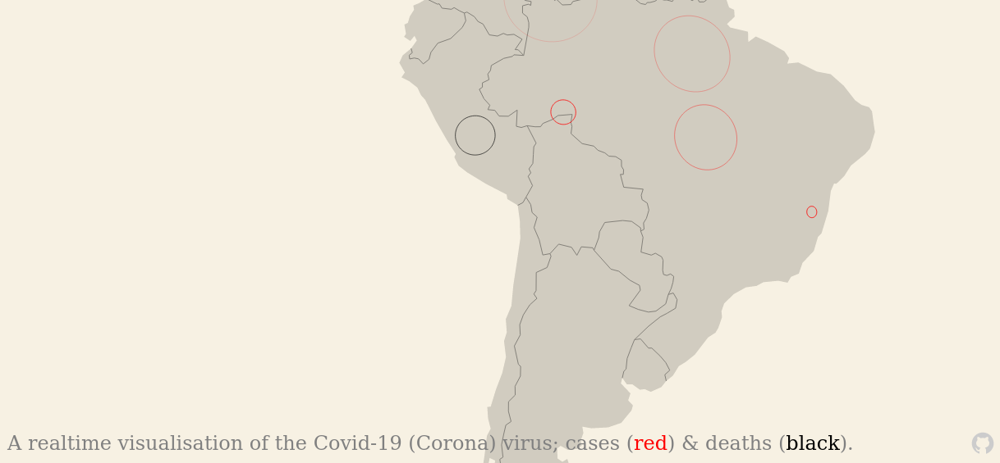

# covid-planet

A realtime visualisation of the Covid-19 (Corona) virus; cases & deaths.

Built using:

- [covid19api](https://covid19api.com/) to get corona data per country
- [GeoJSON data](https://github.com/datasets/geo-countries) to get polygons representing country geographies
- [random-points-on-polygon](https://github.com/apburnes/random-points-on-polygon#readme) to pick a random location within a geographic region
- [D3 js](https://d3js.org/) for the underlying planet visualisation
- [Planetary js](http://planetaryjs.com/) to help with the planet visualisation; adding dots and handling zoom/etc events.

## todo

- deployment process, with regeneration of data
- filled circles not rings
- segmented data for large countries (eg states in the US); us, brazil, russia, india.
- analytics
