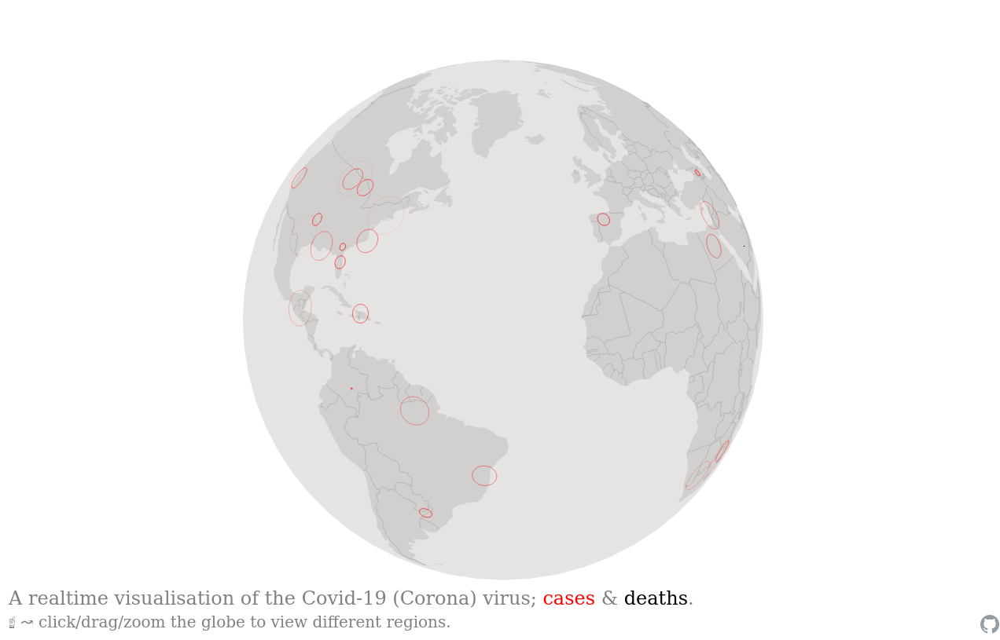

# covid-planet

A realtime visualisation of the Covid-19 (Corona) virus; cases & deaths.

Built using:

- [covid19api](https://covid19api.com/) to get corona data per country
- [covid19api.io](https://github.com/ChrisMichaelPerezSantiago/covid19) to get corona data for individual US states
- [GeoJSON data](https://github.com/datasets/geo-countries) to get polygons representing country geographies
- [usstatesgeojson](https://github.com/glynnbird/usstatesgeojson) to get US state geojson polygons
- [random-points-on-polygon](https://github.com/apburnes/random-points-on-polygon#readme) to pick a random location within a geographic region
- [D3 js](https://d3js.org/) for the underlying planet visualisation
- [Planetary js](http://planetaryjs.com/) to help with the planet visualisation; adding dots and handling zoom/etc events.

## get running

1. `docker-compose up` and go to `http://localhost`

### pulling data locally

Run `docker-compose run app yarn crunch-latest` in a  to populate data locally (this is done automatically in prod every x period)

## redeploy

`bash ./remote-redeploy.sh`

#### todo

- more segmented data for large countries: brazil, russia, india, US.
- flags panning along the bottom corresponding to countries.